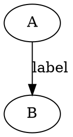
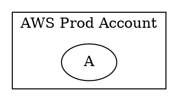
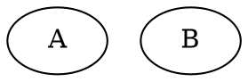

# Dot Language

全体の概要

```dot
// digraph(有向) | graph(無向) 
digraph {
  // graph 全体の設定
  graph [
    // key=value,
  ];

  // node共通の設定
  node [
    // key=value,
  ];

  // edge共通の設定
  edge [
    // key=value,
  ];

  // node_aの定義
  node_a [
    // key=value
  ];

  // node_b,node_cの定義
  node_b,node_c [
    // key=value
  ];

  // node_aとnode_bのedgeの定義
  node_a -> node_b [
    // key=value,
  ];

  // group cluster_aを定義
  // cluster_ は特別な意味をもつ
  subgraph cluster_a [
    
  ]
}
```

## Graph定義


* `layout`: 配置のengine
  * `dot`(default)
  * `fdp`
  * `osage`
  * [engine一覧](https://graphviz.org/docs/layouts/)
* `rankdir`: graphのlayoutの方向
  * `TB`: top to bottom, `BT`もある
  * `LR`: left to right
* `newrank`: trueにするとsubgraphの中のnodeのrankも指定できた

## Node定義

```dot
digraph {

    MyNode [
        label="foo"
    ];
```

## Edge定義



* `lhead`でsubgraph clusterを指定すると矢印がsubgroupで止まる

## Cluster定義



* groupを定義できる
* `cluster_` prefixが意味をもつらしい

## Rank



* `rank`でnodeのrankを指定できる
  * same,min,maxが指定できる
    * minを指定すると一番下、左にできたり

## Example

`[strict] (graph | digraph) [ID] '{'' stmt_list '}`

```dot
digraph {

  // Defaultの指定
  node [ shape=square ];
  A; B; C;

  // 配置がかなりかわる
  layout=dot

  // nodeの設定はcontextっぽい
  node [ shape = circle, width = 0.9]
  1; 2; 3;

  edge [ style=dashed ];

  fontname="Noto Sans CJK JP"
  rankdir="TB"
  hello [ 
    label = "Hello",
    style="
      filled, // 塗りつぶす
      rounded, // 角まるめる
      dashed, // 枠がdot
      solid, // 太線
    "
    ];
  a -> b; [ color="red", penwidth="2.0"]

  subgraph cluster_x {
    label="Foo"
    color="yellow"
    rank = same

    subgraph cluster_x_1 {
      label="Nexted"
      x_1_a -> x_1_b;
    }
  }

  subgraph cluster_y {
    y_a -> y_c
    y_a -> y_b
    y_b -> y_c [constraint=false];
  }

  // 矢印をclusterのboundaryで止める
  node1 -> node2 [ltail="cluster_bar", lhead=cluster_foo];
  // とも書ける
  A -> {B, C, D}
  // 矢印の向き
  // Rankの指定と表現としての方向を制御できる
  lpha -> beta [dir = forward];
  gamma -> delta [dir = back];
  epsilon -> zeta [dir = both];
  eta -> theta [dir = none];

  // rank (top|leftからの距離)
  { rank=same aX aY aZ }
  { rank=same bX bY bZ }
}
```

* `label`: nodeの表示を変えられる
* `color`: 表示の色を指定する
  * graph, node, edgeに指定できる
* `fotnname`: fontの指定
  * edge,node,graph, clusterに書ける
  * 複数指定できる
    * `Helvetica,Arial,sans-serif`
* `subgraph cluster_`ではじめるとclusterとして意図どおりにgroupingしてくれる
  * `cluster_`は特別な意味をもつらしい
  * nestできる
* `constraint=false`を渡すと上下関係(rank)の制約をうけつ並んでくれる
* `lhead,ltail`: 矢印をcluster boundaryに設定する
  * compound=trueが前提
* `penwidth`: 線の太さ。default1.0
  * cluster,node,edge

## Record

```dot
digraph {
  rankdir=LR;
  node [ shape=record ];

  struct1 [
      label = "a|b|<port1>c";
  ];
  
  struct2 [
      label = "a|{<port2>b1|b2}|c";
  ];
  
  struct1:port1 -> struct2:port2 [ label="xyz" ];
```
構造体の関係も表現できる

## HTML like label

labelが`<>`でencoloseされるとhtml likeになる

## Colorscheme

```dot
digraph G {
  node [style=filled, colorscheme=rdpu3];
  GrandpaA -> Papa;
  GrandmaA -> Papa;
  GrandpaB -> Mama;
  GrandmaB -> Mama;
  Papa -> You;
  Mama -> You;
  You [style=filled, fillcolor=1];
  Papa [style=filled, fillcolor=2];
  Mama [style=filled, fillcolor=2];
```

試せてない

## 参考

* [FLow char tutorial](https://sketchviz.com/flowcharts-in-graphviz)
* [Qiitaの網羅的な記事](https://qiita.com/rubytomato@github/items/51779135bc4b77c8c20d)
* [これも研究したい](https://docs.deistercloud.com/content/Axional%20development%20libraries.20/Server%20side%20javascript.50/AX%20Library.10/graph/Grahviz%20examples.2.xml?embedded=true)
