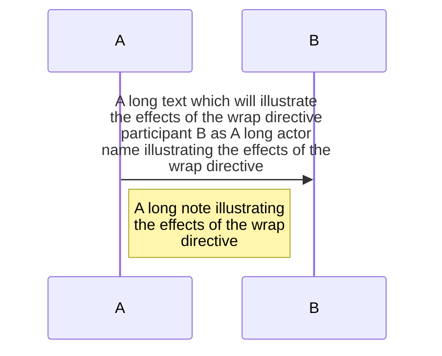
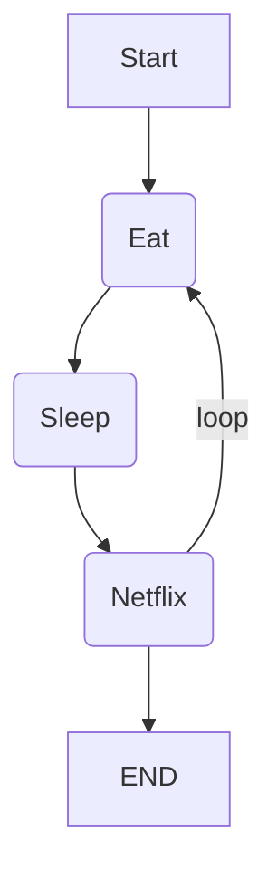
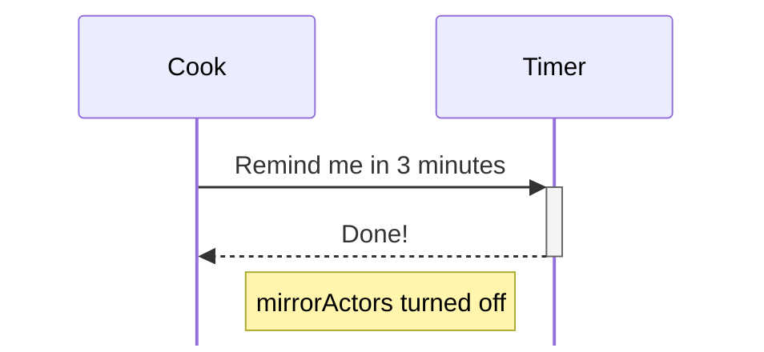

# Mermaid.js

## Directive

```
%%{init: configration-object}%%
```
```
%%{init: {
  "theme": "default",
  "logLevel": 5,
  "sequence": {"mirrorActors": false}
  }
}%%
```

* `theme`
    * base, forest,dark, neutral
* `logLevel`
    * consoleにloggingされる
    * 1:debug, 2:info, 3:warn, 4:error, 5:fatal

* `8.6.0`から導入されたらしい

### Wrap text



* 長いtextがboxに収まるようにする



## Sequence Diagram



* `mirrorActors`
    * sequenceの主体ブロックを下にも表示するかどうか

## ER diagram

```
%%{init: {
    "er": {
        "layoutDirection": "TB",
        "entityPadding": 15,
        "useMaxWidth": true,
    }
}}%%
```

* `layoutDirection` layoutの方向性
    * `TB`: top to bottom. `BT`: bottom to top.
    * `LR`: left to right. `RL`: right to left.

* `entityPadding`: わかっていない
* `useMaxWidth`: 巨大なdiagramの場合はfalseにした方が良い?
