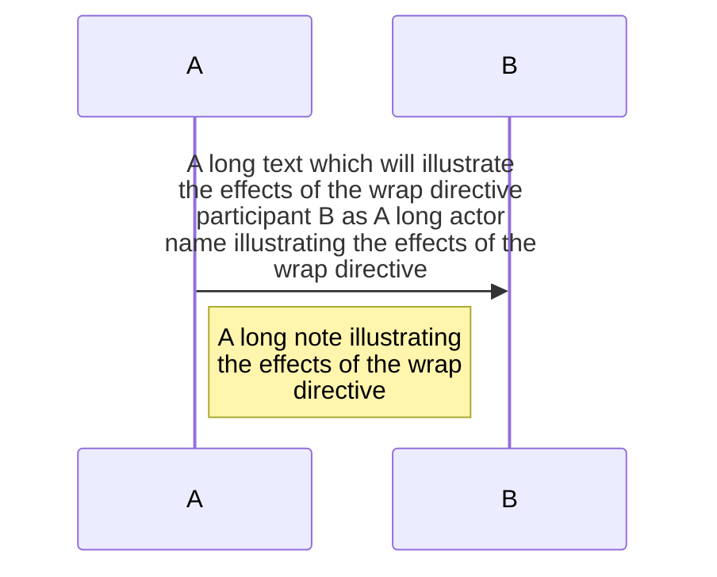

# Mermaid.js

## Directive

```
%%{init: configration-object}%%
```
```
%%{init: {
  "theme": "default",
  "logLevel": 5,
  "sequence": {"mirrorActors": false}
  }
}%%
```

* `theme`
    * base, forest,dark, neutral
* `logLevel`
    * consoleにloggingされる
    * 1:debug, 2:info, 3:warn, 4:error, 5:fatal

* `8.6.0`から導入されたらしい

### Wrap text



* 長いtextがboxに収まるようにする
