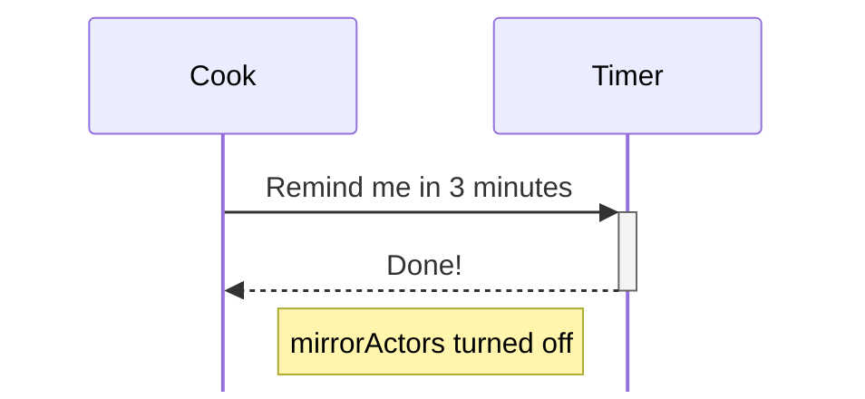

# Sequence Diagram

```mermaid
%%{init: {"sequence": {"mirrorActors": false}}}%%

sequenceDiagram
  Cook->>+Timer: Remind me in 3 minutes
  Timer-->>-Cook: Done!
  Note left of Timer: mirrorActors turned off
```

* `mirrorActors`
    * sequenceの主体ブロックを下にも表示するかどうか

