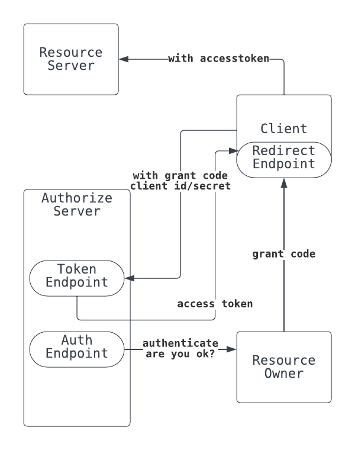

# OAuth

## What is OAuth

RFC6749によると

> The OAuth 2.0 authorization framework enables a third-party application to obtain limited access to an HTTP service

* なんらかのresourceを管理するhttp serviceが認可に利用する、access tokenの発行方法についてのrule

* third-partyにuserのcredential(id/pass)を教えたくない

## 概要

* Client Resource ServerのAPIを利用するapplication
* Resource Owner: Userのこと
* Resource Server: Resource Ownerのなにかを管理してapiで提供しているservice
* Authorize Server: access tokenの発行主体

ClientはResource serverのapiを叩きたい。  
そのためにはaccess tokenが必要。  
access tokenのためには、grant codeが必要。  
なのでUser(Resource owner)をauthorize serverにaccessさせ、authorize serverからのredirect経由で、grant codeをもらう。
ただこれだけ。

## Token

* Access Token
  * ClientがResource Serverへのapi requestに付与するtoken
  * Resource Serverは毎回これを検証してrequestを検証する
  * Authorize Serverが発行する
  * 有効期限をもつ
  * Bearer TokenでRFC6750
* Refres Token
  * ClientがAuthorize Serverから新しいaccess tokenを取得するために利用する
  * 仕様では任意
* Grant code
  * Resource OwnerがClientへの権限移譲に同意したことを表すtoken
  * Authorize ServerがResource OnwerにRedirectすることで、ClientのRedirect endpointに渡す
  * 302 Location: `https://client.ymgyt.io/callback?code=grantcode-xyz` 的な感じ。
  * Resource Owner(browser等)を経由するので、流出しやすい
  * 一度使ったら使えなくなる