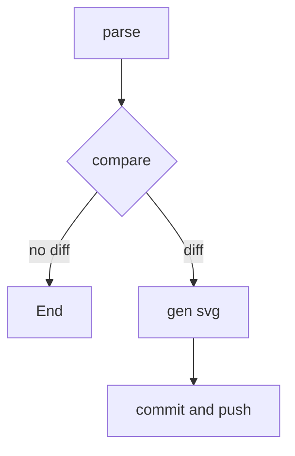
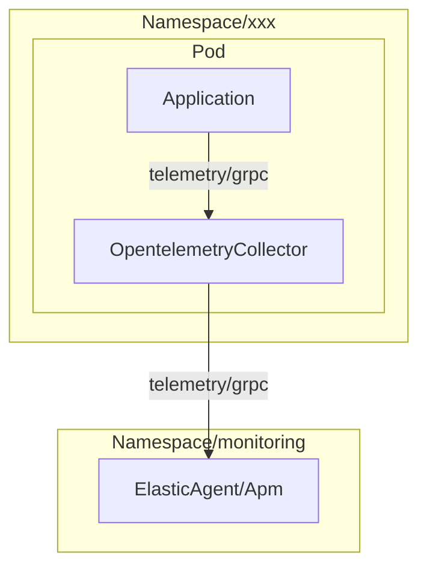

# Flowchart

## Example

```mermaid
flowchart TB
  A[parse] --> B{compare}
  B -->|no diff| C[End]
  B -->|diff| D[gen svg]
  D --> E[commit and push]
```

subgraphを使うことで、scopeを表現できる。  
subgraphはnestさせることもできる

```mermaid
flowchart TB
   subgraph Namespace/xxx
     subgraph Pod
       Application --telemetry/grpc--> OpentelemetryCollector
     end
   end

   subgraph Namespace/monitoring
     OpentelemetryCollector --telemetry/grpc--> ElasticAgent/Apm
   end
```

